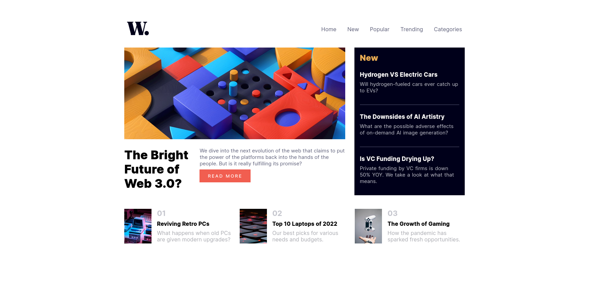
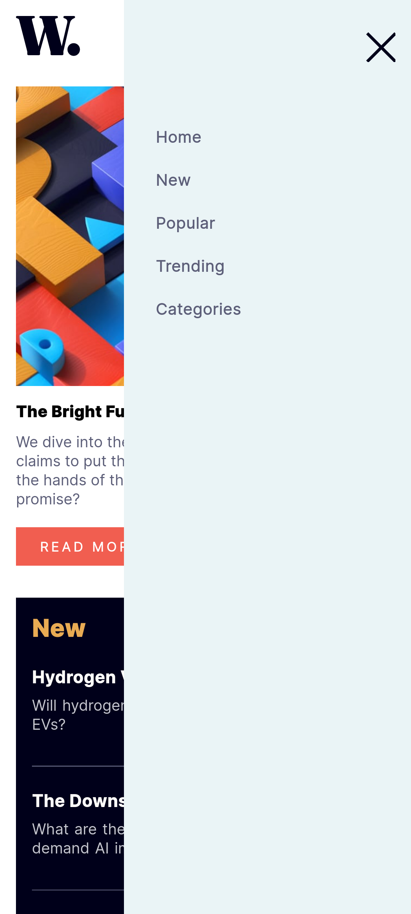

# Frontend Mentor - News homepage solution

This is a solution to the [News homepage challenge on Frontend Mentor](https://www.frontendmentor.io/challenges/news-homepage-H6SWTa1MFl). Frontend Mentor challenges help you improve your coding skills by building realistic projects. 

## Table of contents

- [Overview](#overview)
  - [The challenge](#the-challenge)
  - [Screenshot](#screenshot)
  - [Links](#links)
- [My process](#my-process)
  - [Built with](#built-with)
  - [What I learned](#what-i-learned)
  - [Continued development](#continued-development)
  - [Useful resources](#useful-resources)
- [Author](#author)
- [Acknowledgments](#acknowledgments)

**Note: Delete this note and update the table of contents based on what sections you keep.**

## Overview
    This is my solution to the Frontend Mentor Junior challenge, the News Hompepage.
### The challenge

### Screenshot

#Hamburger Menu

### Links

- Solution URL: [Add solution URL here](https://github.com/mikeqd/news-homepage-challenge-solution.git)
- Live Site URL: [Add live site URL here](https://mikeqd.github.io/news-homepage-challenge-solution/)

## My process

### Built with

- Semantic HTML5 markup
- CSS custom properties
- Flexbox
- CSS Grid
- Mobile-first workflow

### Continued development

- I plan on learning to use TailwindCSS in my future projects.
- I will most definitely go into depth in Flexbox and Grid in CSS since I have come to discover that there is always more to it than I think I know. 

## Author

- Website - [Michael Quam Donkor](https://sveltekit-portfolio-v1.vercel.app/)
- Frontend Mentor - [@mikeqd](https://www.frontendmentor.io/profile/mikeqd)
- Twitter - [@1youngdev](https://www.twitter.com/1youngdev)
